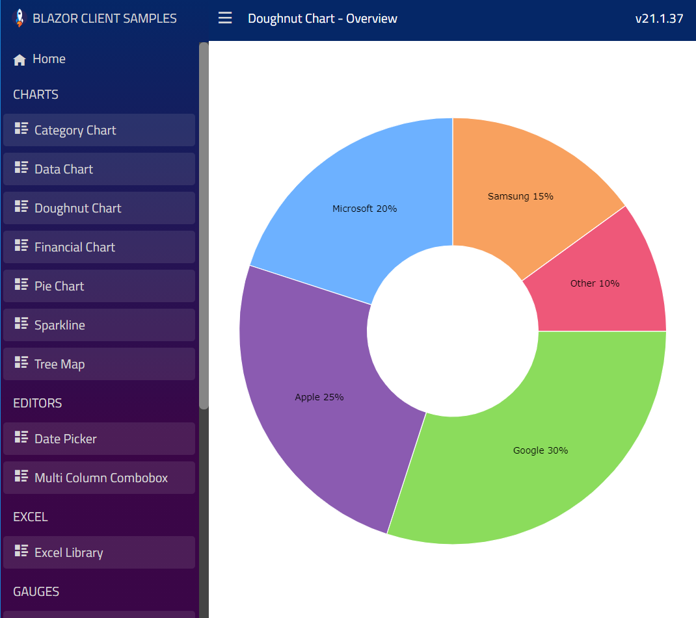

<div style="display: flex; flex-flow: row; font-family: 'Titillium Web'">
    
</div>

# Examples of Ignite UI for Blazor Components

This repository contains over 300 examples on how to use [Ignite UI for Blazor](https://www.infragistics.com/products/ignite-ui-blazor/blazor/components/general-getting-started.html) components:

- Charts:
[Area](https://www.infragistics.com/blazorsite/components/charts/types/area-chart),
[Bar](https://www.infragistics.com/blazorsite/components/charts/types/bar-chart),
[Column](https://www.infragistics.com/blazorsite/components/charts/types/column-chart),
[Composite](https://www.infragistics.com/blazorsite/components/charts/types/composite-chart),
[Donut](https://www.infragistics.com/blazorsite/components/charts/types/donut-chart),
[Financial/Stock](https://www.infragistics.com/blazorsite/components/charts/types/stock-chart),
[Line](https://www.infragistics.com/blazorsite/components/charts/types/line-chart),
[Pie](https://www.infragistics.com/blazorsite/components/charts/types/pie-chart),
[Polar](https://www.infragistics.com/blazorsite/components/charts/types/polar-chart),
[Radial](https://www.infragistics.com/blazorsite/components/charts/types/radial-chart),
[Scatter](https://www.infragistics.com/blazorsite/components/charts/types/scatter-chart),
[Shape](https://www.infragistics.com/blazorsite/components/charts/types/shape-chart),
[Sparkline](https://www.infragistics.com/blazorsite/components/charts/types/sparkline-chart),
[Stacked](https://www.infragistics.com/blazorsite/components/charts/types/stacked-chart),
[Step](https://www.infragistics.com/blazorsite/components/charts/types/step-chart),
- Maps:
[Geographic Map](https://www.infragistics.com/blazorsite/components/geo-map.html),
[Treemap](https://www.infragistics.com/blazorsite/components/treemap-overview.html),
- Gauges:
[Bullet Graph](https://www.infragistics.com/blazorsite/components/bullet-graph),
[Linear Gauge](https://www.infragistics.com/blazorsite/components/linear-gauge.html),
[Radial Gauges](https://www.infragistics.com/blazorsite/components/radial-gauge.html)
- Grids:
[Table / Grid](https://www.infragistics.com/blazorsite/components/data-grid.html),
[Excel Library](https://www.infragistics.com/blazorsite/components/excel_library_using_workbooks.html)
- Other:
[Dock Manager](https://www.infragistics.com/blazorsite/components/dock-manager),
[Date Picker](https://www.infragistics.com/blazorsite/components/editors/date-picker),
[Multi-Column Combobox](https://www.infragistics.com/blazorsite/components/editors/multi-column-combobox)

You can run each sample project individually from the [./samples](./samples) folder or you can browse all samples in one website from the [./browser](./browser) folder.
<!-- In addition, you can run each sample on Code Sandbox website by clicking on the `Edit on CodeSandbox` button in a readme file of sample project, e.g.

[./samples/charts/category-chart/overview/README.md](./samples/charts/category-chart/overview/README.md) -->


## Preview

You can preview and browse all samples in this repository by opening our [Blazor Samples Browser](https://infragistics.com/blazor-client/). Alternatively, you you can view these samples with detailed information in our [Blazor Help Documentation](https://www.infragistics.com/products/ignite-ui-blazor/blazor/components/general-getting-started.html).

In addition, you can run each sample project individually from the [./samples](./samples) folder or you can run from the [./browser](./browser) folder to browse all samples in one website (see instructions below).

## Setup

To set up this project locally, clone this repository:
```
git clone https://github.com/IgniteUI/igniteui-blazor-examples.git
```

> **_NOTE:_** You should use [master](https://github.com/IgniteUI/igniteui-blazor-examples/tree/master) branch of this repository if you want to run samples on your computer. Use the [vnext](https://github.com/IgniteUI/igniteui-blazor-examples/tree/vnext) branch only when you want to contribute new samples to this repository.

## Running Individual Sample

Note, as of 2022, this repo is targeting .NET 6.0 and Visual Studio 2022. VS 2019 does not support .NET 6.0.

- check out the **master** branch

- in VS 2022, open a solution file from the [./samples](./samples) folder, e.g.

[./samples/charts/category-chart/overview/BlazorClientApp.csproj](./samples/charts/category-chart/overview/BlazorClientApp.csproj)

- right click solution and select **Restore NuGet Packages** menu item

- click **Debug** menu and select **Start Debugging** or press **F5** key

- Wait until the build is completed and then open [http://localhost:4200](http://localhost:4200) in your browser

At this point, you should see a website with a single example of [Ignite UI for Blazor](https://infragistics.com/blazorsite/components/general-getting-started.html) component.


## Running All Samples

- check out the **master** branch

- open VS Code as Administrator

- open the [./browser/IgBlazorSamples.Gulp](./browser/IgBlazorSamples.Gulp) folder

- select **View** - **Terminal** menu item

- type `npm install` command

- type `gulp copySamplesToClient` command

- wait until all samples are copied to the browser client app

- in VS 2022, open [./browser/IgBlazorSamplesBrowser.sln](./browser/IgBlazorSamplesBrowser.sln)

- right click solution and select **Restore NuGet Packages** menu item

- click **Debug** menu and select **Start Debugging** or press **F5** key

- Wait until the build is completed and then open [http://localhost:4200](http://localhost:4200) in your browser

At this point, you should see a website hosted all examples of [Ignite UI for Blazor](https://infragistics.com/blazorsite/components/general-getting-started.html) components.




## Resources

- [Razor Component Models](https://www.codemag.com/article/1911052)
- [Razor Syntax](https://docs.microsoft.com/en-us/aspnet/core/blazor/components/?view=aspnetcore-3.1#razor-syntax)
- [Getting reference to components](https://docs.microsoft.com/en-us/aspnet/core/blazor/components/?view=aspnetcore-3.1#capture-references-to-components)
